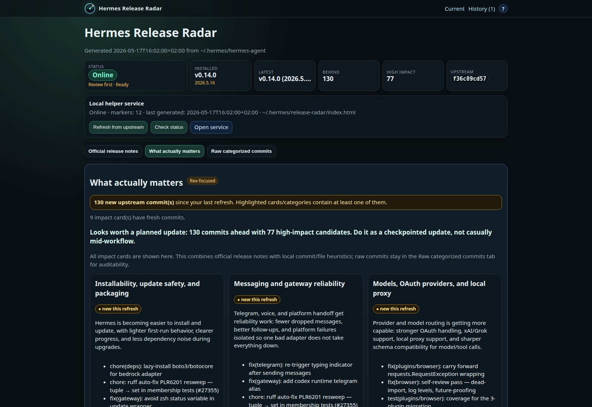
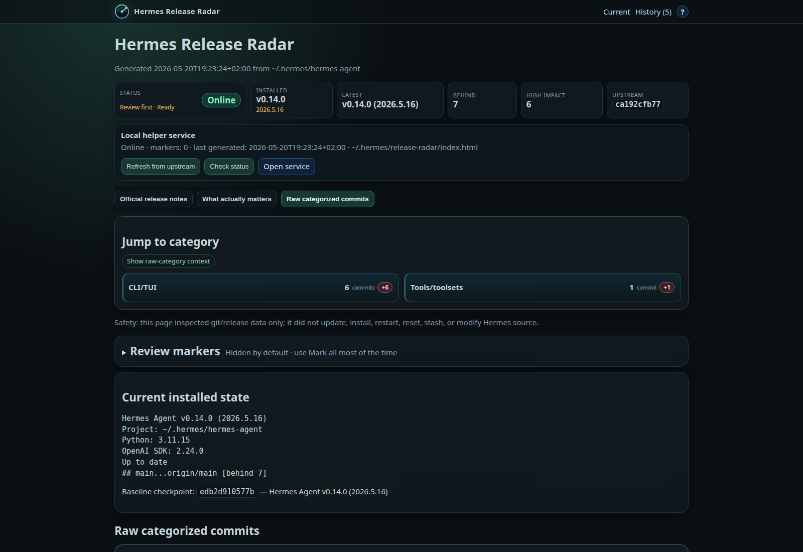

# Hermes Release Radar

Hermes Release Radar is a local, safe update-intelligence page for Hermes Agent.

It answers: what changed upstream since the Hermes checkout I am running now, and what actually matters?

Current project version: `0.3.0-public`.

## Current local URL

```text
http://127.0.0.1:8765/
```

## Public demo vs local mode

The GitHub Pages/public demo is a separate static build under `public/`. It uses only public Hermes Agent repository data and is safe to publish.

The public demo does not know what you have installed, does not persist review markers, does not call the local helper API, and does not provide personalized update advice. Run Release Radar locally for installed-vs-upstream comparison, marker persistence, local modified-file checks, and update decisions.

## What it does

- Inspects the local Hermes Agent checkout at `~/.hermes/hermes-agent`.
- Compares local `HEAD` with `origin/main`.
- Generates a calm browser page with:
  - Official release notes, only when a newer release tag is actually ahead.
  - `What actually matters` cards for human review.
  - Raw categorized commits for auditability.
  - Durable review markers stored in `state.json`.
  - Installed-update history once Hermes actually advances.
- Runs as a local-only helper service on `127.0.0.1:8765`.

## Screenshots

### What actually matters

Human-readable impact cards summarize the important change clusters first, with representative commits still visible for auditability.



### Raw categorized commits

The raw view keeps the full commit trail grouped by category, with review markers and safety notes available in the same page.



## Safety contract

Release Radar does not update Hermes.

It may run:

```bash
git fetch origin --quiet
python3 ~/.hermes/release-radar/generate.py
```

It must not run:

```bash
hermes update
git reset
git stash
git restore
```

It must not install packages, restart Hermes services, or bind outside localhost without a separate explicit approval process.

## Quick install

See the full help page:

- `HELP.md`
- `docs/help.html`

Short version:

```bash
git clone https://github.com/vampyren/Hermes-Release-Radar.git ~/Apps/Hermes-Release-Radar
mkdir -p ~/.hermes/release-radar/runs ~/.config/systemd/user
cp ~/Apps/Hermes-Release-Radar/src/generate.py ~/.hermes/release-radar/generate.py
cp ~/Apps/Hermes-Release-Radar/src/serve.py ~/.hermes/release-radar/serve.py
cp ~/Apps/Hermes-Release-Radar/HELP.md ~/.hermes/release-radar/HELP.md
cp ~/Apps/Hermes-Release-Radar/docs/help.html ~/.hermes/release-radar/help.html
python3 ~/.hermes/release-radar/generate.py
cp ~/Apps/Hermes-Release-Radar/systemd/hermes-release-radar.service ~/.config/systemd/user/hermes-release-radar.service
systemctl --user daemon-reload
systemctl --user enable --now hermes-release-radar.service
```

Open:

```text
http://127.0.0.1:8765/
```

## Useful commands

```bash
systemctl --user status hermes-release-radar.service --no-pager --lines=30
systemctl --user restart hermes-release-radar.service
journalctl --user -u hermes-release-radar.service -n 80 --no-pager
curl -s http://127.0.0.1:8765/api/status
curl -s -X POST http://127.0.0.1:8765/api/refresh
```

## Repository layout

```text
.github/workflows/public-pages.yml       Scheduled/manual public demo rebuild
src/generate.py                          Local private page generator
src/generate_public.py                   Public GitHub Pages/demo generator
src/serve.py                             Local-only helper server
systemd/hermes-release-radar.service     User systemd service
public/index.html                        Generated public demo page
public/snapshot.json                     Generated public demo data snapshot
docs/help.html                           Rendered help page
docs/RELEASE_LOG.md                      Public project changelog
scripts/render_help.py                   Markdown-to-help HTML renderer
HELP.md                                  Operator help
README.md                                Project overview
PURPOSE.md                               Project purpose and principles
VERSION                                  Current project version
```

## Versioning and releases

Release Radar uses semantic-ish project versions separate from Hermes Agent versions.

- Major: architecture or safety-model changes.
- Minor: user-facing features, generated page structure changes, helper API changes, or state-model additions.
- Patch/suffix: UI polish, docs, correctness fixes, or reliability improvements.

Git tags use the current project version with a leading `v`, for example `v0.2.7-ui`.

Release checklist:

```bash
python3 -m py_compile src/generate.py src/serve.py scripts/render_help.py
git status --short --branch
git tag -a vX.Y.Z-suffix -m "vX.Y.Z-suffix"
git push origin vX.Y.Z-suffix
gh release create vX.Y.Z-suffix --title "vX.Y.Z-suffix" --notes-file /tmp/release-notes.md
```

## Verification

```bash
python3 -m py_compile src/generate.py src/serve.py
python3 ~/.hermes/release-radar/generate.py
curl -s http://127.0.0.1:8765/api/status
```
